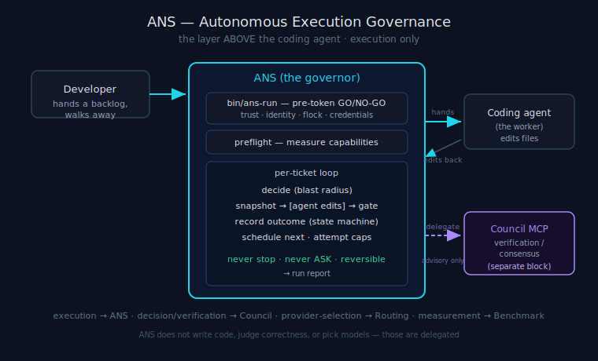

# ANS Architecture

> **30-second version.** Agents Never Sleep (ANS) is **Autonomous Execution Governance** — a thin,
> deterministic governance layer that sits *above* a coding agent. The agent does the work; ANS decides
> what an unattended run should do when it is unsure (PROCEED / PARK / HALT), keeps every change
> reversible, and never lets one unanswerable question stall the rest of the backlog. This document
> describes the components and how they compose. ANS owns **execution only**: it does not generate code,
> judge correctness, or pick models — see [Scope boundary](#scope-boundary) and the
> [glossary](glossary.md).



*Diagram: ANS architecture: a developer hands a backlog to ANS, which governs a coding agent and delegates verification to the Council MCP.*

## Why a separate layer at all

A coding agent left to run for hours has exactly one response to uncertainty: **stop and ask**. That is
fine with a human watching and fatal at 2am — one unanswerable question wastes the whole run. The
missing piece is not a smarter model; it is an *operational* layer that decides **how an agent should
behave while it works unattended**: when to assume-and-continue, when to defer a decision and move on,
when (rarely) to stop everything — and how to make every one of those choices reversible and auditable.

That layer is a **governance** problem, not an AI problem, which is why ANS is deliberately *not* an LLM.
The harness is stdlib Python with no model calls. This is load-bearing: it means the governance logic is
deterministic and inspectable, and it forces the clean division of labour the whole system rests on (see
[Execution Model](execution-model.md)).

## The components

Each component is a single module under `agents_never_sleep/` (ANS v1.0.0). They compose into one loop;
none of them is a model.

| Component | Module | Responsibility |
|---|---|---|
| **Decision engine** | `decide.py` | Classify a ticket PROCEED / PARK / HALT by *blast radius*; enumerate the Hard-PARK categories; detect requirement-meaning ambiguity. |
| **Outcome state machine** | `state.py` | The seven durable per-ticket outcomes; contamination scope; atomic, resume-safe, secret-scrubbed writes. |
| **Deterministic gate** | `gates.py` | Run the project's own non-interactive check (tests / type-check) after each diff, with a timeout and a TTY-free environment. The **only hard gate**. |
| **Reversibility / VCS** | `vcs.py` | Snapshot the working tree before an edit; revert to last-green if the gate fails on the diff; refuse to edit unrevertibly. |
| **Anti-starvation ledger** | `ledger.py` | Durable attempt counts + failure-signature loop detection, so the run is never burned on one cursed ticket. |
| **Scheduler / breaker** | `orchestrator.py` | Pick the next *independent* ticket; trip the low-yield circuit breaker when most work is parked/blocked/failing. |
| **Agent-as-worker driver** | `driver.py` | Invert the loop so the *agent* implements one ticket per call; own the run-incomplete sentinel. |
| **Preflight** | `preflight.py` | Measure capabilities (VCS, gates, integrations) after the session boots; never stop the run, only lower expected yield. |
| **Launcher** | `launcher.py` (`bin/ans-run`) | Pre-token GO/NO-GO gate: config trust, identity, agent selection, credentials, repo health, host checks, working-tree flock. |
| **Watchdog** | `watchdog.py` | Sidecar that restarts a *hung* run (the gap the Stop-hook cannot see) and alerts on exhausted restarts. |
| **Secret redaction** | `redact.py` | Shape-anchored scrubbing of credential-shaped values from the report, gate artefacts, comments, and emitted JSON. |
| **Keysource** | `keysource.py` | Resolve `env:` / `vault:` token-refs into credentials; never a literal in the config; degrade to a blind spot, never a silent empty value. |
| **Work sources** | `sources/` | Where tickets come from: a directory of `.md` files (default) or a configured Paperclip project. |
| **Run report** | `report.py` | The run report: done / parked / needs-daylight-review / spend / blind spots. |
| **Delegated review (advisory)** | `council.py`, `specialists.py` | Scaffolding to *delegate* a second opinion to the external Tokonomix Council MCP — see [Scope boundary](#scope-boundary). |

The **public API surface** of these components (CLI subcommands, ticket format, gate interface, the
stable outcome values, the config file shape, the launcher CLI) is documented in the repo's
`ARCHITECTURE.md`; this file is the *conceptual* counterpart — how the pieces fit and why.

## How they compose — one loop

```
                 ┌──────────────────────────── bin/ans-run (launcher.py) ────────────────────────────┐
                 │  pre-token GO/NO-GO: TOFU config-trust · identity/root-guard · agent select +     │
                 │  --version probe · keysource credential resolution · repo health · working-tree   │
                 │  flock · host checks.   exit 0=GO · 64=NO-GO · 65=tree busy.                       │
                 └───────────────────────────────────────┬──────────────────────────────────────────┘
                                                          │ spawns the agent CLI (autonomy-confirmed)
                                                          ▼
   preflight.py ──► capability scan (never stops the run; lowers expected yield)
                                                          │
                 ┌────────────────────────────────────────┴───────────── per-ticket loop ───────────┐
                 │  sources/ ──► tickets.py: load the backlog                                         │
                 │  decide.py ──► PROCEED / PARK / HALT by blast radius (auto-park high-blast-radius) │
                 │  driver.py ──► hand the agent ONE PROCEED ticket  ─────────►  AGENT edits files    │
                 │  vcs.py    ──► snapshot before edit                                                │
                 │  gates.py  ──► run the deterministic gate after the diff (the ONLY hard gate)      │
                 │      fail-on-diff ──► vcs.py revert to last-green ──► ledger.py attempt/loop ──► PARK│
                 │  council.py/specialists.py ──► (optional) DELEGATE advisory review → trust-or-flag │
                 │  state.py  ──► record exactly one durable outcome                                  │
                 │  orchestrator.py ──► low-yield breaker; pick next INDEPENDENT ticket               │
                 └───────────────────────────────────────┬──────────────────────────────────────────┘
                                                          ▼
   watchdog.py (sidecar) restarts a hung run        report.py ──► run report
```

The harness owns scheduling, parking, snapshot/revert, the attempt cap, loop detection, and the
never-stop sentinel. The **agent** owns exactly one thing: implementing the ticket body it was handed.
That division is the subject of the [Execution Model](execution-model.md).

## Reliability spine first, quality machinery on top

ANS was built spine-first: durable per-ticket state, concrete PARK-vs-continue semantics, and
anti-starvation are the hard part and shipped first. The heavier delegated-review funnel was layered on
top. As of v1.0.0 the spine *and* the quality machinery (agent-as-worker bridge, delegated council /
specialist scaffolding, never-ASK enforcement, secret redaction, watchdog, Vault keysource, Paperclip
integration, the fresh-session loop) are all built. Verify any status claim against the modules above.

## Scope boundary

ANS owns **execution only**: execution governance, scheduling, autonomy, resilience, recoverability,
reversibility, workflow continuity, deterministic execution, operational safety. ANS is **explicitly
NOT** responsible for code generation, model quality, AI reasoning, consensus, or verification.

So when the architecture touches "review", read it precisely: ANS does **not** verify code. For a
high-risk diff it may *optionally delegate* a second opinion to an external verification/consensus layer
— the **Tokonomix Council MCP**, a separate, standalone building block — and use the verdict for one
purpose only: to flag the work `DONE_LOW_CONFIDENCE` / NEEDS DAYLIGHT REVIEW. The multi-model reasoning
happens outside ANS (the harness cannot call an LLM). `council.py` and `specialists.py` are the *delegation
scaffolding*, not a verification engine. Advisory always: it never blocks the run and never reverts a diff.

## ANS in the Tokonomix ecosystem

ANS is one of many planned specialized Tokonomix building blocks, each standalone-usable but stating its
place: **ANS → execution**, **Council MCP → decision-making / verification**, **Media QC → output
verification**, **Benchmark → measurement**, **Routing → provider selection**, **Memory → long-term
context**. The rule of thumb: *if it is not "how an unattended agent should behave while it works", it is
not ANS.* Code generation → the coding agent; is-the-code-correct → the deterministic gate + delegated
Council; which model → Routing. See the [glossary](glossary.md) for the full ecosystem table.

## Limitations

ANS is a governance layer, not a correctness oracle. The deterministic gate (your tests) is the only hard
correctness check; a delegated council second opinion is advisory and never a guarantee; model agreement
is recall, not truth. A wrong PROCEED assumption is possible — blast-radius tiering lowers the odds but
does not zero them; the defence is reversibility, not infallibility. Enforcement strength varies by host:
only Claude Code is live-verified today; other platforms are built to their documented hook contracts. No
benchmark *results* are claimed here — the autonomy metrics are a [methodology](benchmarks.md).

---

*Verified against `agents_never_sleep/` (v1.0.0): `decide.py`, `state.py`, `gates.py`, `vcs.py`,
`ledger.py`, `orchestrator.py`, `driver.py`, `preflight.py`, `launcher.py`, `watchdog.py`, `redact.py`,
`keysource.py`, `run.py`, `report.py`, `sources/`, and the repo `ARCHITECTURE.md`.*
