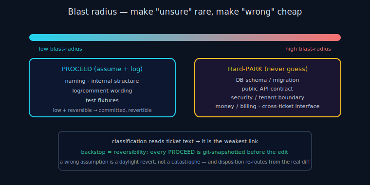

# ANS Blast Radius

> **30-second version.** *Blast radius* is how far a wrong decision can spread. ANS uses it as the single
> dial for PROCEED vs PARK: low blast-radius **and** reversible → assume and continue; high blast-radius →
> never guess, always defer (Hard-PARK). The point is to make "unsure" rare and to make the *cost of being
> wrong* small — because classification is the weakest link, the real safety net is reversibility, not a
> perfect classifier. See the [decision model](decision-model.md) and [glossary](glossary.md).

*Diagram: Blast radius as the PROCEED-vs-Hard-PARK dial, backstopped by reversibility.*

## Why blast radius is the right dial

The naive question — "is the agent confident enough to proceed?" — is the wrong one, because confidence is
exactly what an unsupervised model cannot calibrate. The right question is: **if this assumption is wrong,
how bad and how reversible is it?** A wrong variable name is a trivial, local, instantly-reversible
mistake. A wrong database migration direction can corrupt data and break every downstream ticket. Those
should never be treated the same way, regardless of how confident the agent feels. Blast radius captures
that asymmetry directly.

So ANS tiers decisions by blast radius and resolves the two extremes deterministically:

- **Low blast radius + reversible → PROCEED.** Assume a reasonable answer, log it, commit it (so it can be
  reverted), continue.
- **High blast radius → Hard-PARK.** Defer the decision and keep the run moving; do not guess no matter how
  reversible it looks.

## The Hard-PARK categories (never guessed)

These are enumerated in `decide.py` (`HARD_PARK_CATEGORIES`) so the rule is concrete, not a judgement call.
A ticket whose text matches any of them is parked even if it superficially looks safe:

| Category | What it covers | Foundational? | Contamination scope |
|---|---|---|---|
| **DB schema / migration** | migration direction, alter/drop/add column, create table, schema change | yes | SERVICE |
| **API contract** | public/shared API, request/response shape, endpoint contract | yes | SERVICE |
| **Security / tenant** | auth, authz, permissions, RBAC, JWT, session, tenant/data isolation | yes | SERVICE |
| **Money / billing** | billing, pricing, invoice, payment, charge, refund, tax/VAT | no | MODULE |
| **Cross-ticket interface** | shared interface, "other tickets depend", breaking change | yes | PACKAGE |

A *foundational* park also quarantines dependents: the scheduler will not hand the agent a ticket whose
contamination scope intersects the parked one, so nothing gets built on top of an unresolved foundation.

There is also a softer tier — **requirement-meaning ambiguity** (the agent doesn't know *what* to build):
if it is not in a hard category and is both reversible and isolated, ANS may build it narrowly behind a
flag *and* park the choice (a hybrid); otherwise it parks outright.

## What the tiers map to in practice

- **PROCEED examples:** naming, internal code structure, log / comment / error wording, test fixtures,
  picking between two equivalent local implementations, a trivially-toggled default.
- **Hard-PARK examples:** "should migration B replace A or run alongside it?", "what should the public
  endpoint return?", "which tenants can see this?", "what do we charge?", "does this change a shared
  interface other tickets use?"

When in doubt and a ticket fits neither extreme cleanly, the default is **PARK**, because of the asymmetry
below.

## Classification is the weakest link → reversibility is the backstop

Honest framing: the classifier reads ticket *text* and matches patterns. It can be wrong — a ticket could
phrase a high-blast-radius change in innocuous words and slip through as PROCEED. ANS does not pretend the
classifier is perfect. Instead it makes that imperfection cheap with three layers of backstop:

1. **Conservative default.** Unclassifiable → PARK. A wrongly-parked small item costs a 5-second morning
   decision; a wrongly-assumed big one costs a night of wrong work. The tiering leans toward the cheap
   mistake.
2. **Reversibility.** Every PROCEED is snapshotted before the edit (`vcs.py`); a wrong assumption is a
   daylight revert, not a catastrophe. This is the real safety net — *the system is built so a wrong call
   is recoverable*, not so the classifier never errs.
3. **Disposition from the actual diff.** Trust-or-flag is re-routed from the *real* change, not just the
   ticket text, so a diff that turns out to touch a high-risk surface is flagged for daylight review even
   if the ticket text didn't trip a category.

The thesis: you cannot make an autonomous classifier infallible, so you make being wrong **safe**. Blast
radius decides *whether to guess*; reversibility decides *what happens when the guess is wrong*. Together
they let the night make real progress without a human watching.

## Boundary: blast radius governs execution, not correctness

A high-risk diff may additionally get a *delegated* advisory second opinion from the external Tokonomix
Council MCP — but that is verification, which ANS does not own; it only feeds the trust-or-flag
disposition. Blast-radius tiering is purely about *which execution decisions an unattended agent may make
on its own*. See the [governance](governance.md) and [architecture](architecture.md) scope boundaries.

## Limitations

Blast-radius tiering lowers the odds of a damaging wrong assumption; it does not zero them. Pattern
matching on ticket text has false negatives; the backstop is reversibility and diff-based disposition, not
a claim of perfect classification.

---

*Verified against `agents_never_sleep/` (v1.0.0): `decide.py` (`HARD_PARK_CATEGORIES`, the PROCEED/PARK
flow, the requirement-meaning hybrid branch), `state.py` (`ContaminationScope`, foundational parks),
`vcs.py` (snapshot/revert), README §3.*
