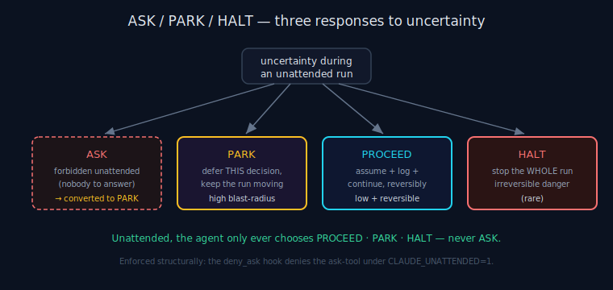

# ANS Decision Model

> **30-second version.** For every ticket, ANS decides one of three actions — **PROCEED** (assume + log +
> keep going), **PARK** (defer this decision, move to the next independent ticket), or **HALT** (stop the
> whole run). The decision is made by *blast radius*, not by guesswork: low-impact + reversible → PROCEED;
> high-impact (schema, API, security, money, cross-ticket) → PARK; while unattended, **ASK always becomes
> PARK**. The logic is deterministic (`decide.py`), so "what will the agent do here?" is predictable and
> auditable. ANS decides *execution* actions only — see the [governance](governance.md) doc.

*Diagram: The ASK / PARK / HALT autonomy contract; ASK is forbidden unattended and becomes PARK.*

## The three actions

| Action | Meaning | When |
|---|---|---|
| **PROCEED** | Assume a reasonable answer, log it, continue. Commit it so it can be reverted. | Low blast-radius **and** reversible: naming, internal structure, log/comment wording, test fixtures, a choice between two equivalent local implementations. |
| **PARK** | Defer this one decision/ticket; keep the run moving to the next independent ticket. Record why, the candidate interpretations, the exact human next-action, and the contamination scope. | High blast-radius (the enumerated Hard-PARK categories), or requirement-meaning ambiguity that isn't both reversible and isolated. |
| **HALT** | Stop the whole run. | Genuinely irreversible danger, or no reversibility safety net at all. |

The action enum lives in `decide.py` (`Action.PROCEED` / `PARK` / `HALT`). Unattended, the agent only
ever chooses among these three.

## The rule: ASK → PARK while unattended

The fourth conceivable action — **ASK the human** — is forbidden under `CLAUDE_UNATTENDED=1`. There is
nobody to answer at 2am, and a single blocking question would waste the entire night. So *every* impulse
to ask is converted into a PARK: defer this decision, write down exactly what a human should decide in the
morning, and move on. This is enforced two ways — by the decision logic (which never emits ASK
unattended) and structurally by the `deny_ask` hook, which denies the `AskUserQuestion` tool outright.

## How a ticket is classified (the `decide.py` flow)

The classifier reads the ticket text and applies, in order:

1. **Operator override.** If the project config maps this ticket id to an explicit action
   (`classify.overrides`), use it. (This exists because substring matching can mis-classify — e.g. a
   docs ticket that merely *mentions* "migration" should not be auto-parked.)
2. **Hard-PARK categories.** If the text matches any enumerated high-blast-radius category, **PARK** —
   regardless of how reversible it looks. The categories (`HARD_PARK_CATEGORIES`) are:
   - `db_schema_or_migration` (migration, alter/drop/add column, create table, schema change) — *foundational*, SERVICE scope
   - `api_contract` (api contract, request/response shape, public api, endpoint contract) — *foundational*, SERVICE scope
   - `security_or_tenant` (auth, authz, permission, tenant, rbac, access control, jwt, session, isolation) — *foundational*, SERVICE scope
   - `money_or_billing` (billing, price/pricing, invoice, payment, charge, refund, tax, vat) — MODULE scope
   - `cross_ticket_interface` (shared interface, cross-ticket, other tickets depend, breaking change) — *foundational*, PACKAGE scope
3. **Requirement-meaning ambiguity.** If the text signals that the agent doesn't know *what* to build
   ("which", "what kind", "unclear", "ambiguous", "TBD", "decide", a trailing "?") and it is **not** in a
   hard category, **PARK** the decision (`category=requirement_meaning`, not foundational). The one place
   ANS may instead build narrowly behind a flag *and* park the choice (a hybrid) is on this branch.
4. **Otherwise → PROCEED.** Low blast-radius + reversible: assume and do.

Because every branch is an enumerated rule, the decision is deterministic and inspectable — you can read
a ticket and predict the action, and the morning report can explain exactly why each one was taken.

## Foundational vs decision parks

A park carries whether it is *foundational*:

- **PARKED_DECISION** — a single deferred decision. The run keeps moving; nothing downstream is blocked
  beyond that one choice.
- **PARKED_FOUNDATIONAL** — the ambiguity is structural. The ticket parks **and** its dependents are
  quarantined (the scheduler will not hand the agent a ticket whose contamination scope intersects this
  one), so the agent never builds on top of an unresolved foundation.

Contamination scope (`MODULE` < `PACKAGE` < `SERVICE`) is how far the risk spreads; the scheduler uses it
to pick a genuinely *independent* next ticket.

## Why "unsure" is rare by design

The blast-radius tiering is concrete precisely so the agent is rarely in a fuzzy middle. Almost everything
is either clearly low-impact-and-reversible (PROCEED) or clearly in an enumerated high-impact category
(PARK). When something is genuinely unclassifiable, the safe default is **PARK** — a wrongly-parked small
item costs a 5-second morning decision; a wrongly-assumed big one costs a night of wrong work. That
asymmetry is the entire reason the tiering leans conservative. (See [blast radius](blast-radius.md) for
why classification is treated as the weakest link and reversibility as the backstop.)

## Decisions ANS does NOT make

ANS decides *execution* actions. It does **not** decide whether the code is correct (that is the
deterministic gate plus, for high-risk diffs, a *delegated* advisory opinion from the external Tokonomix
Council MCP), nor which model to use (Routing), nor what the code should say (the coding agent). The
delegated review feeds exactly one ANS decision: trust the finished work, or flag it
`DONE_LOW_CONFIDENCE` / NEEDS DAYLIGHT REVIEW. See the [glossary](glossary.md) ecosystem table.

## Limitations

The classifier matches ticket *text*; a ticket that hides a high-blast-radius change behind innocuous
wording could be mis-classified as PROCEED — which is why (a) operator overrides exist, (b) the
post-implementation gate and reversibility are the real backstop, and (c) ANS re-routes disposition from
the *actual diff*, not just the ticket text. No decision is a correctness guarantee.

---

*Verified against `agents_never_sleep/` (v1.0.0): `decide.py` (`Action`, `HARD_PARK_CATEGORIES`,
`AMBIGUITY_SIGNALS`, the `decide()` flow, the F5 build-narrow branch), `state.py` (`ContaminationScope`,
the parked outcome states), README §3.*
