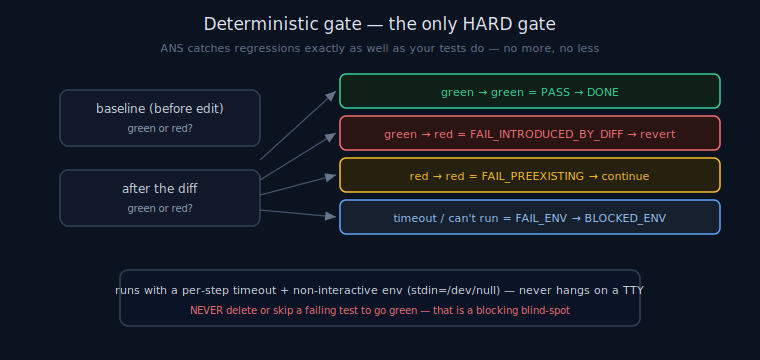

# ANS Deterministic Gates

> **30-second version.** The deterministic gate is the project's own non-interactive check — your test
> suite or type-check — run after every diff. It is the **only HARD gate** in ANS: the single thing that
> can block a ticket. The honest consequence: **ANS catches regressions exactly as well as your tests do,
> and no better.** ANS does not verify correctness itself — that is not its job. The gate's real
> sophistication is in *attributing* a red result (your diff vs. pre-existing noise) so a flaky repo
> doesn't turn the run into "always blocked". See [recovery](recovery.md), [scope](architecture.md#scope-boundary), [glossary](glossary.md).

*Diagram: Gate failure attribution by comparing the baseline to the post-edit run.*

## Why the gate is deterministic — and why that matters

ANS governs an unattended run; it cannot itself judge whether a diff is *correct*. So it leans on the one
correctness signal that is already in the repo, already trusted by the team, and **deterministic**: the
test suite (or `tsc --noEmit`, `pytest`, `make check`, whatever the project runs). A deterministic gate is
the right backbone for autonomy because its result is reproducible and inspectable — exit 0 = green,
non-zero = red — with no model in the loop to hallucinate a pass. The governance layer stays deterministic
all the way down.

The gate command is configured per project in `.claude/agents-never-sleep.json` (the `gates` array; e.g.
`["npx", "tsc", "--noEmit"]`), and run by `GateRunner` in `gates.py`.

## The honest claim: ANS is exactly as good as your tests

This is stated plainly because it is load-bearing and it would be dishonest to imply otherwise: **ANS
catches a regression if and only if your gate catches it.** If your tests don't cover a behaviour, ANS
will happily mark a diff that breaks that behaviour as DONE — because the gate was green. ANS is a
governance layer, not a test-writer and not a correctness oracle. The quality of the safety net is the
quality of your suite. Investing in the gate is investing in the autonomy.

## Failure attribution — the part that makes it usable overnight

A naive "run the tests, block on red" gate is useless in a real repo, because repos have pre-existing
failures, flaky tests, and environment hiccups — and a run that blocks on all of them becomes "always
blocked by repo noise". ANS's gate therefore **attributes** every red result by comparing a baseline
(before the edit) to the post-edit run. The taxonomy (`GateResult` in `gates.py`):

| Baseline | After diff | Result | Disposition |
|---|---|---|---|
| green | green | **PASS** | DONE (proceed to optional delegated review) |
| green | red | **FAIL_INTRODUCED_BY_DIFF** | **Hard-block:** revert to last-green, then `FAILED_RETRYABLE` (or force-park at the attempt cap). |
| red | red | **FAIL_PREEXISTING** | The diff didn't cause it — **downgrade confidence, continue or park**; never reported as "the ticket failed". |
| (any) | timeout / cannot run | **FAIL_ENV** | An environment problem, not the diff → `BLOCKED_ENV`. |

So only a regression the diff *introduced* hard-blocks. A pre-existing red is not blamed on the agent, and
an environment failure is `BLOCKED_ENV`, not a code failure. This is what lets the gate be both strict
(real regressions are caught and reverted) and survivable (repo noise doesn't wedge the night).

## Built so it can never hang overnight

Two properties keep the gate safe for unattended use (`gates.py`):

1. **Per-step timeout.** Each gate command runs under a timeout (a heartbeat is blind to a single hung
   command, so the timeout is the real protection). On timeout it returns rc 124 + a `[gate timed out
   after Ns]` note and is classified `FAIL_ENV`.
2. **Non-interactive environment.** The gate runs with `stdin` redirected to `/dev/null` and a
   non-interactive environment (`DEBIAN_FRONTEND=noninteractive`, git/npm/apt/ssh prompts disabled), so it
   can never block at 2am waiting on a TTY prompt.

## The one inviolable rule

**Never delete or skip a failing test to make the gate green.** That would convert the only hard
correctness signal into a blind spot — the worst possible outcome for a governance layer. A genuinely
pre-existing red is *attributed* as such (and continues); it is never silenced. ANS treats "made the gate
green by removing the test" as a blocking blind-spot, not a success.

## Boundary: the gate is correctness; verification is delegated

The deterministic gate is the *only* hard gate. A high-risk diff may *additionally* get an advisory second
opinion, but that opinion is **delegated** to the external Tokonomix Council MCP and **never blocks** —
it can only flag `DONE_LOW_CONFIDENCE` / NEEDS DAYLIGHT REVIEW. So the layering is: the gate is the hard,
deterministic, repo-owned correctness check; the delegated council is a soft, advisory, externally-owned
recall amplifier; ANS owns neither the test logic nor the model reasoning — only running the gate and
acting on its result. See [governance](governance.md) and the [glossary](glossary.md) ecosystem table.

## Limitations

The gate is only as good as the suite behind it; uncovered behaviour is invisible to it. Baseline
attribution assumes the baseline is a fair comparison (a test that flakes between the baseline and the
post-edit run can be mis-attributed in either direction). The timeout protects against a hung command but
must be sized for the slowest legitimate gate run.

---

*Verified against `agents_never_sleep/` (v1.0.0): `gates.py` (`GateResult` = PASS /
FAIL_INTRODUCED_BY_DIFF / FAIL_PREEXISTING / FAIL_ENV, `GateRunner`, baseline vs post-edit attribution,
per-step timeout → rc 124, `_NONINTERACTIVE_ENV`, `stdin=DEVNULL`), README §6.*
