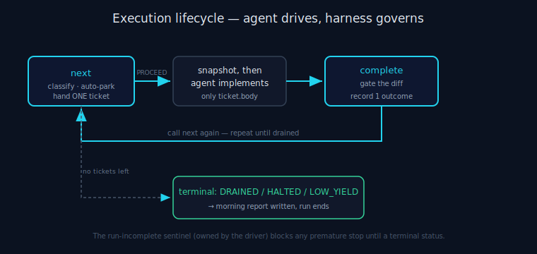

# ANS Execution Model

> **30-second version.** ANS runs a backlog by inverting the usual loop: the **agent is the worker**,
> and the **harness is the governor**. The harness hands the agent exactly one ready-to-implement ticket
> at a time (`next`), the agent edits files, then the harness gates the diff and records one durable
> outcome (`complete`) — repeat until the backlog drains. The agent's *only* job is "implement the ticket
> body I handed you"; everything else (scheduling, parking, snapshot/revert, attempt caps, the never-stop
> guarantee) is deterministic Python. ANS owns **execution only** — see the [architecture](architecture.md)
> and the [glossary](glossary.md).



*Diagram: The next → implement → complete loop, repeating until a terminal status.*

## The core idea: the agent IS the worker

The in-process orchestrator can call a deterministic `Worker` synchronously — that is how the hermetic
acceptance demo self-tests. But in a real unattended run there is no callable worker function: the worker
is an LLM-backed coding agent that cannot be invoked from inside a Python `for` loop. It reads a ticket,
edits files, and re-enters the harness to record the result.

So ANS **inverts the loop**. Instead of the harness calling the worker, the harness hands the agent one
PROCEED ticket and the *agent* calls back into the harness to gate and record. PARK / HALT / attempt-cap
/ breaker decisions stay entirely in Python — the proven spine — so the only thing ever asked of the
unattended agent is the most reliable thing it can do: *implement the ticket body, then call complete.*
Everything else is structural, not a matter of the agent's diligence.

This is the whole separation-of-concerns thesis in one mechanism: **the worker (agent) writes code; the
governor (ANS) decides what an unattended run should do and keeps it reversible.** Verification — is the
code *correct* — is neither's job; it is the deterministic gate plus, optionally, a *delegated* second
opinion (below).

## The loop — `next` → implement → `complete`

The agent drives two subcommands, each printing one JSON object to stdout, until a terminal status:

```
python3 -m agents_never_sleep.run next     --repo . --tickets <dir>     # get ONE ticket or a terminal signal
   └─ status PROCEED ──► implement ONLY ticket.body by editing files
python3 -m agents_never_sleep.run complete --repo . --tickets <dir> --attempted "<one line>"
   └─ records the outcome ──► call `next` again
```

`next` returns one of:

- **`PROCEED`** — a ready ticket (`ticket.body`, a snapshot id, and optionally a `council` /
  `specialists` block). Implement *only* this ticket; do not touch other tickets, do not stop, do not ask.
- **`DRAINED` / `HALTED` / `LOW_YIELD`** (the terminal set in `run.py`) — the run is over and the run
  report is written. Stop.
- **`NON_DESTRUCTIVE`** — unattended with no saved config; do a configuring interactive run first.

On `complete`, the agent passes `--attempted "<summary>"`, or `--cannot-implement` (with `--attempted`
explaining why) when it genuinely cannot do the ticket — in which case the harness reverts the partial
edits and records `BLOCKED_ENV`. If the PROCEED payload carried a delegated-review block and the agent
ran it, the verdict is fed back via `--council-verdict` / `--specialist-concerns` (advisory trust-gating
only fires when reported). The same `--tickets <dir>` must be passed on **both** `next` and `complete`.

> **Important:** there is **no `run` subcommand**. The old in-process `run` was removed; real runs always
> use this `next`/`complete` flow. The auxiliary subcommands are `report`, `reset-attempts`,
> `reset-spend`, and `parked`.

## The two structural guarantees

The driver (`driver.py`) enforces the two things the agent must never be trusted to remember:

1. **Sentinel ownership (never stop at 2am).** The Stop-hook blocks a premature end-of-turn while
   `.unattended/run-incomplete` exists. The driver owns that file: it stays set while any non-terminal
   ticket remains and is cleared **only** when the backlog is genuinely drained / halted / low-yield-
   tripped. "Never stop" is therefore enforced by the *file*, not by the agent's diligence to keep
   calling `next`. (The sentinel path is pinned via `UE_RUN_INCOMPLETE` so the hook and driver agree even
   when CWD ≠ repo; running from the repo root with `--repo .` makes them agree automatically.)

2. **Resume-safe progress.** Each `next` / `complete` is a *fresh process*, so breaker accounting is
   recomputed from the durable store every call (never held in memory). A crash *between* `next` and
   `complete` is recovered on the next `next`: the partial edits are reverted to the pending snapshot and
   the ticket is re-scheduled under its attempt cap. State is atomic and resume-safe by construction.

## The per-ticket sequence (what the harness enforces)

1. **Preflight** measures capabilities (`preflight.py`) — VCS/reversibility, platform, gates, execution
   mode, optional integrations. A missing capability never stops the run; it lowers expected yield and
   raises conservatism. No VCS → establish a safety net before any risky edit; if impossible →
   non-destructive only.
2. **Decide** PROCEED / PARK / HALT for the ticket by blast radius (`decide.py`). Unattended: ASK → PARK.
   High-blast-radius categories (schema/migration, API contract, security/tenant, money/billing,
   cross-ticket interface) are auto-parked so the agent is only ever handed something safe to assume.
3. **Implement** — the agent edits files for this one PROCEED ticket.
4. **Gate** deterministically (`gates.py`) — the backbone. A diff-introduced failure hard-blocks (revert +
   park/fail); a pre-existing / flaky / environment failure downgrades confidence but is *never* reported
   as "the ticket failed"; a timeout/env failure is `BLOCKED_ENV`. The gate runs with a per-step timeout
   and a non-interactive environment so it can never hang on a TTY prompt. **Never delete or skip a failing
   test to go green.**
5. **Record** exactly one durable outcome (`state.py`): one of the seven states (DONE,
   DONE_LOW_CONFIDENCE, PARKED_DECISION, PARKED_FOUNDATIONAL, BLOCKED_ENV, FAILED_RETRYABLE,
   FAILED_BUG_IN_AGENT), with its required fields. Atomic, resume-safe, secret-scrubbed.
6. **Next ticket** — `orchestrator.py` picks the next *independent* ticket (one whose contamination scope
   does not intersect a parked ticket's).

## Scheduling & anti-starvation

The run is never burned on one cursed item:

- **Attempt cap** (`ledger.py`) — a ticket attempted past its cross-resume cap is force-parked. The ledger
  is durable, so a kill+resume does not reset the count (use `reset-attempts <ticket>` for the documented
  "tooling round-trip inflated the counter" case).
- **Loop detection** (`ledger.py`) — a ticket that loops fast under budget, failing with the same stable
  failure signature, is force-parked rather than retried forever.
- **Low-yield breaker** (`orchestrator.py`, `LowYieldBreaker`) — stops the run and alerts when, on a
  non-trivial backlog (≥ 8 processed), the bad ratio (parked + blocked + failed / processed) reaches 0.75.
  A systematically broken environment fails fast instead of grinding on for the whole run.
- **Independent-next scheduling** — the scheduler only picks a next ticket whose contamination scope does
  not intersect a parked one, so the agent never builds on top of an unresolved foundational decision.

## Context strategy for long backlogs

A single agent session that drives a long backlog **degrades as it accumulates** — empirically around
ticket ~19 it starts deferring large/live-facing work and losing earlier constraints. The *harness* state
never degrades (each `next`/`complete` is a fresh subprocess that rejoins the run branch); what degrades
is the one long agent context. The hybrid answer:

- **Short / coupled backlogs** → one session; the agent CLI's built-in auto-compact (near the window
  ceiling) handles it.
- **Long / independent backlogs** → the opt-in `launcher.fresh_session_every` knob (default `0` = off)
  spawns a *fresh* agent session every N tickets; durable per-ticket state means ticket 40 gets ticket 1's
  quality.
- **Never** a mid-task percentage-trigger compaction — it summarises lossily mid-thought and busts the
  prompt cache.

## Delegated review is not part of execution

When a PROCEED payload carries a `council` or `specialists` block, the agent may *delegate* a second
opinion on a high-risk diff to the external **Tokonomix Council MCP**. This is **advisory**: it never
blocks the run and never reverts a diff. Its only effect on execution is the disposition — a high-risk
diff whose delegated review raised concerns / errored / never ran is recorded `DONE_LOW_CONFIDENCE` +
NEEDS DAYLIGHT REVIEW. Verification happens *outside* ANS; ANS governs only the trust-or-flag decision
around it. See the [architecture](architecture.md) scope boundary and the [glossary](glossary.md).

## Limitations

The execution model guarantees *reversibility and continuity*, not correctness. The deterministic gate is
the only hard gate; a wrong PROCEED assumption is possible and is precisely why every change is
snapshotted and revertible. Cross-platform enforcement of the never-stop / never-ask guarantees is
live-verified only on Claude Code; elsewhere it is built to the platform's documented hook contract.

---

*Verified against `agents_never_sleep/` (v1.0.0): `driver.py`, `run.py`, `state.py`, `gates.py`,
`ledger.py`, `orchestrator.py`, `preflight.py`, `vcs.py`, and the repo `ARCHITECTURE.md` + README.*
