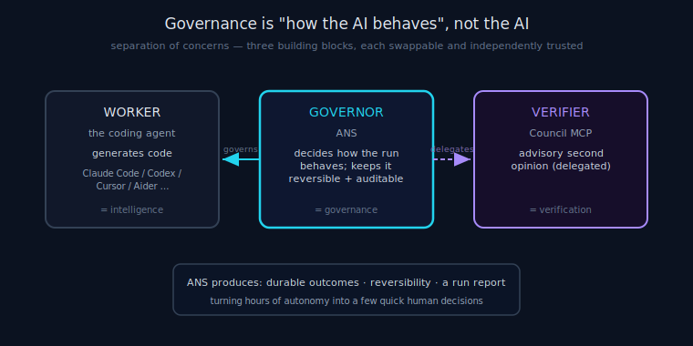

# ANS Governance

> **30-second version.** Governance, in ANS, means **deciding how an AI agent should behave while it
> works unattended** — not controlling the AI's intelligence, and not writing or judging its code. ANS
> is the policy layer that turns "an agent that can act" into "an agent you can safely leave running for
> hours": it says when to assume-and-continue, when to defer a decision, when to stop, and it keeps every
> action reversible and auditable. ANS owns **execution governance only**; verification belongs to a
> [delegated layer](#what-governance-is-not). See the [glossary](glossary.md).

*Diagram: Separation of concerns: worker (agent), governor (ANS), verifier (Council).*

## Governance is "how the AI behaves", not "the AI"

The distinction is the whole point. A coding agent is *intelligence*: it reads a ticket and produces a
diff. ANS is *governance*: it decides what an unattended run should do with the uncertainty the
intelligence inevitably hits. These are different concerns, and conflating them is why most autonomous
runs stall.

Concretely, governance answers operational questions the model cannot answer for itself without a human
in the loop:

- This decision is irreversible and high-stakes — should the agent guess, or defer it?
- A test failed — was it my diff, or was it already red? Revert, or continue?
- I've attempted this ticket three times — keep trying, or move on so the run isn't wasted?
- Most of this run's work is getting parked — is the environment broken? Should I stop and alert?

None of these are about *how good the code is*. They are about *how an unsupervised actor should conduct
itself*. That is a governance problem, and it is why ANS is deliberately not a model — the policy is
deterministic stdlib Python so it is inspectable and never itself hallucinates.

## The autonomy contract as policy

The governing policy is the **autonomy contract**: an unattended run has exactly three responses to
uncertainty, and they are never collapsed into one another.

- **ASK** — ask the human. **Forbidden while unattended** and enforced structurally (the `deny_ask`
  hook denies `AskUserQuestion` under `CLAUDE_UNATTENDED=1`). There is nobody there to answer; one
  blocking question wastes the run.
- **PARK** — defer *this one decision or ticket* and keep the run moving to the next independent ticket.
  Parking is the healthy, normal response to a high-stakes unknown — the opposite of stopping.
- **HALT** — stop the *whole run*. Only for genuinely irreversible danger or the total absence of a
  reversibility safety net.

Unattended, the agent only ever chooses **PROCEED, PARK, or HALT** — never ASK. Collapsing these three
is exactly how a run inverts into the stalling it exists to prevent: an ASK becomes a silent stall, a HALT
becomes an over-reaction that ends the run, a missing PARK turns every unknown into one of those two.
Keeping them distinct is the policy.

## Why governance has to be its own layer

Three structural reasons, each a design principle (see the [manifesto](manifesto.md) for the full
argument):

1. **Separation of concerns.** The worker (the coding agent), the governor (ANS), and the verifier (the
   delegated Council) are different responsibilities. Each can be reasoned about, swapped, and trusted
   independently. Bolting governance into the model would couple three things that change at different
   rates.
2. **Determinism.** Governance decisions — park vs proceed, revert vs continue, cap vs retry — must be
   predictable and auditable. A model asked to govern itself would make these decisions probabilistically
   and inconsistently. ANS makes them with enumerated rules.
3. **Least privilege + fail-safe.** An unsupervised agent that can edit files and run shells is powerful;
   governance is what bounds that power (reversibility, blast-radius tiering, the pre-token launcher
   gate). The safe default is always the conservative one — park, revert, flag for daylight — never the
   silent risky one.

## What governance produces

Governance is only useful if the aftermath is clearer than the run was uncertain. ANS makes every
governed run produce a durable, auditable trail:

- **One durable outcome per ticket** (`state.py`) — DONE, parked (with why + the exact human next-action),
  blocked, or failed. Nothing is lost between resumes.
- **Reversibility** (`vcs.py`) — every PROCEED is snapshotted; a wrong assumption is a cheap revert,
  not a catastrophe.
- **A run report** (`report.py`) — what got done, what parked and why, what needs daylight review,
  what it cost, and any blind spots. Governance turns a run of autonomous work into a few quick
  human decisions.

## What governance is NOT

ANS governs execution. It does **not** generate code, judge whether code is correct, reason about model
quality, or run consensus/verification. When a high-risk diff warrants a second opinion, ANS *delegates*
it to an external verification/consensus layer — the **Tokonomix Council MCP**, a separate building
block — and uses the verdict for one governance purpose only: to trust the work or flag it
`DONE_LOW_CONFIDENCE` / NEEDS DAYLIGHT REVIEW. The verification reasoning happens outside ANS; governance
only decides trust-or-flag. See the [decision model](decision-model.md), [blast radius](blast-radius.md),
and the ecosystem table in the [glossary](glossary.md).

## Limitations

Governance lowers the cost of being wrong; it does not make the agent correct. The deterministic gate
(your tests) is the only hard correctness check; the delegated council is advisory. A wrong PROCEED is
possible — the defence is reversibility, not infallibility. Enforcement of the never-ASK / never-stop
policy is live-verified only on Claude Code; on other hosts it is built to the documented hook contract.

---

*Verified against `agents_never_sleep/` (v1.0.0): `decide.py`, `state.py`, `vcs.py`, `report.py`, the
`deny_ask`/Stop hooks in `hooks/`, README §3.*
