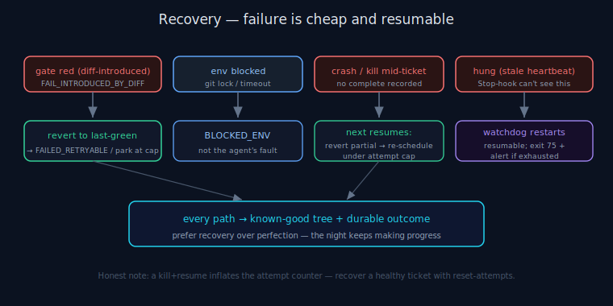

# ANS Recovery

> **30-second version.** ANS is built so failure is cheap and resumable, not catastrophic. A diff that
> breaks the gate is **reverted** to the last-green snapshot; an environment that blocks progress is
> recorded `BLOCKED_ENV`, not blamed on the agent; a crash or kill mid-run is **resumed** on the next
> `next` (partial edits reverted, ticket re-scheduled under its attempt cap); and a *hung* run — the one
> failure the Stop-hook cannot see — is restarted by a sidecar **watchdog** that alerts and exits `75` when
> restarts are exhausted. See [state machine](state-machine.md), [scheduling](scheduling.md), [glossary](glossary.md).

*Diagram: Four recoverable failure paths: red gate, environment block, crash, and hang.*

## The recovery philosophy: prefer recovery over perfection

An autonomous run *will* hit failures — a flaky test, a git lock, a model that produces a broken diff, a
machine that hangs. The design goal is not to prevent every failure (impossible) but to make each one a
*recoverable* event with a clear, durable record, so the night keeps making real progress and the morning
knows exactly what to do. Every recovery path below leaves the working tree in a known-good state.

## 1. Red gate → revert to last-green

Before the agent edits anything, ANS takes a git snapshot (`vcs.py`). After the diff, the deterministic
gate runs (`gates.py`). If the gate fails **because of the diff**, ANS reverts the working tree to that
last-green snapshot — the broken change never survives. The ticket is then recorded `FAILED_RETRYABLE`
(retry is safe because the tree is clean) or, if it has hit its attempt cap, force-parked. Crucially, a
gate failure that is **pre-existing, flaky, or environmental** is *not* treated as the ticket failing — it
downgrades confidence and the run continues. ANS never reports "the ticket failed" for a red that the diff
did not introduce, and it **never deletes or skips a failing test to go green**.

## 2. Environment blocked → BLOCKED_ENV (not the agent's fault)

Some failures are not about the code at all: a git lock that prevents the snapshot commit, a gate command
that cannot run, a read-only object store, a timeout. ANS records these as `BLOCKED_ENV` — a first-class
state distinct from a code failure. The agent's partial edits are reverted, and the morning report says
"fix the environment and re-run", not "the agent couldn't do it". If a snapshot commit genuinely cannot be
made, ANS treats the ticket as `BLOCKED_ENV` rather than editing unrevertibly — reversibility is never
sacrificed to make progress.

## 3. Crash / kill mid-ticket → resume on the next `next`

Because each `next`/`complete` is a *fresh process* and all progress is durable (`state.py`), a crash or
kill is recovered structurally. On the next `next`:

- Tickets already in a terminal-skip state (DONE, DONE_LOW_CONFIDENCE, PARKED_*) are **not** re-offered.
- A ticket that was *in-flight* (snapshot taken, no `complete` recorded) is recovered: the partial edits
  are reverted to the pending snapshot, and the ticket is re-scheduled under its attempt cap.
- Breaker / spend accounting is recomputed from the durable store, never from lost in-memory state.

**Honest gotcha:** a kill+resume increments the per-ticket attempt counter (it is durable by design). A
tooling round-trip that kills and resumes can therefore push a *healthy* ticket to its attempt cap and
force-park it. The first-class fix is the `reset-attempts <ticket>` subcommand, which clears the inflated
counter so the ticket can be picked up again. (This is a known operational edge, documented rather than
hidden.)

## 4. Hung run → the watchdog (the gap the Stop-hook cannot see)

The Stop-hook prevents a premature *stop*, but it cannot detect a *hang* — a run that is alive but making
no progress (a wedged subprocess, a network call that never returns). That is the watchdog's job
(`watchdog.py`):

- It runs the unattended command as a **child** and polls the child's heartbeat file.
- The heartbeat is beaten at `next`/`complete` boundaries; in the agent-driven loop a single ticket can
  legitimately take up to the per-ticket budget (default 1800s) to implement. So the stale threshold
  (`--stale`, **default 2400s**) must *exceed* that worst-case single-ticket time, or the watchdog would
  false-restart a healthy run mid-ticket.
- If the heartbeat goes stale past the threshold, the watchdog kills the child and **restarts it
  resumable** — and because state is durable, the restart picks up exactly where the run was.
- On **exhausted restarts** (`--max-restarts`, default 3) it runs the optional `--alert` command (e.g. a
  Paperclip issue creator) and **exits `75`**.

Integrating the watchdog is **opt-in composition** — wrap the unattended command with it (see
`WATCHDOG.md`); it is never a rewrite of any shared launcher/wrapper.

> Read the heartbeat correctly: heartbeat *age climbing during a ticket is normal* (the agent is
> implementing). A real stall is high age **and** no commit **and** no file edits.

## What recovery does NOT do

Recovery restores a known-good *tree* and a known *outcome*; it does not make the reverted code correct on
retry, and it does not verify the surviving diff. The deterministic gate is the only hard correctness
check; a high-risk diff's optional second opinion is *delegated* to the external Tokonomix Council MCP and
is advisory. Recovery is about continuity and reversibility, not correctness — see [governance](governance.md).

## Limitations

The watchdog detects a stale *heartbeat*, not semantic wedging that still beats the heartbeat; the stale
threshold must be tuned to the per-ticket budget or it false-restarts. `reset-attempts` is a manual
operator action for the documented counter-inflation case. Resume guarantees a clean tree and a correct
re-schedule, not that a previously-failing ticket will now pass.

---

*Verified against `agents_never_sleep/` (v1.0.0): `vcs.py` (snapshot/revert), `gates.py` (failure
taxonomy), `state.py` (`BLOCKED_ENV`, `FAILED_RETRYABLE`, resume-skip), `ledger.py` (attempt cap,
`reset_attempts`), `driver.py` (resume-safe progress), `watchdog.py` (`--stale` 2400s, `--max-restarts` 3,
exit 75), `run.py` (`reset-attempts`), `WATCHDOG.md`.*
