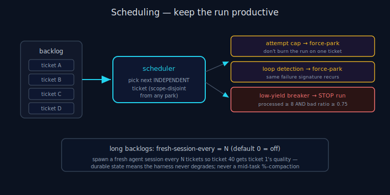

# ANS Scheduling

> **30-second version.** ANS schedules tickets so the run is never burned on one cursed item and never
> builds on an unresolved foundation. It hands the agent only an **independent** next ticket (one whose
> risk does not intersect a parked one), force-parks a ticket that exceeds its **attempt cap** or is
> provably **looping**, trips a **low-yield circuit breaker** when most work is failing, and — for long
> backlogs — can spawn a **fresh agent session every N tickets** so quality doesn't degrade. See
> [recovery](recovery.md), [state machine](state-machine.md), [glossary](glossary.md).

*Diagram: Independent-next scheduling plus the attempt cap, loop detection, and low-yield breaker.*

## The scheduling goal: keep the run productive

A naive loop ("do tickets in order, retry on failure") fails an unattended run two ways: it can spend the
whole run retrying one broken ticket, and it can pile work on top of a decision that was never made.
ANS's scheduler (`orchestrator.py` + `ledger.py`) exists to prevent both, so an unattended run converts a
backlog into *real, reversible progress* rather than a wedged loop. None of this is specific to running
overnight — the same mechanisms apply whether the run starts at midnight or the middle of a workday.

## Independent-next selection

After each ticket, the scheduler picks the next one — but only a ticket whose **contamination scope** does
not intersect a parked ticket's scope. Scope is `MODULE` < `PACKAGE` < `SERVICE` (`state.py`). When a
ticket parks *foundationally* (e.g. an unresolved schema or API decision), its dependents are quarantined:
the scheduler skips them rather than letting the agent build on an unknown. This is why parking is safe —
the run keeps moving, but never onto contaminated ground.

## Anti-starvation: attempt cap + loop detection

Two durable mechanisms in `ledger.py` (`AttemptLedger`) stop one item from eating the run:

- **Attempt cap.** Each ticket's attempt count persists across resumes. When it exceeds the cap, the
  ticket is **force-parked** instead of retried again — "parked to avoid burning the night on one ticket".
  Because the count is durable, a kill+resume does not reset it (and can inflate it — use `reset-attempts`
  for that documented case; see [recovery](recovery.md)).
- **Loop detection.** A ticket can fail *fast* under budget, the same way every time. The ledger records a
  stable **failure signature** (`failure_signature()` extracts the stable identifiers so a varying
  timestamp or path doesn't defeat detection). When the same signature recurs past the loop threshold, the
  ticket is force-parked — a fast loop is caught even when the attempt cap by count alone wouldn't trip.

## The low-yield circuit breaker

Some failures are systemic: a broken toolchain, a missing dependency, an environment where *nothing*
passes. Retrying ticket after ticket would waste the whole run producing parks and blocks. The
`LowYieldBreaker` (`orchestrator.py`) stops the run and alerts when the work is mostly unproductive:

- It only trips on a **non-trivial backlog** (`min_tickets = 8`) — a tiny 3-ticket demo is safe.
- It trips when the **bad ratio** — (parked + blocked + failed) / processed — reaches **0.75**.

When it trips, the run ends with the `LOW_YIELD` terminal status and the run report explains why. This
is fail-fast governance: a systematically broken run ends loudly instead of grinding silently.

## Context strategy for long backlogs — `fresh_session_every`

A single agent session that drives a long backlog **degrades as it accumulates** — empirically around
ticket ~19 the context starts deferring large/live-facing work and losing earlier design constraints. The
*harness* state never degrades (every `next`/`complete` is a fresh subprocess on the durable store); what
degrades is the one long agent context. The opt-in knob:

- **`launcher.fresh_session_every`** — integer ≥ 0, **default `0` = off** (byte-identical legacy behaviour:
  one agent session drives the whole loop).
- **`N > 0`** — the launcher supervises a bounded loop: spawn an agent with a ticket budget of N, wait for
  it to exit, check the run-incomplete sentinel; if work remains, spawn a **fresh** agent for the next N.
  Durable per-ticket state means ticket 40 gets ticket 1's quality.

The coordination is careful: while a budget is set, the driver counts recorded completions and, at N,
flips the `complete` response's hint from "call `next`" to "STOP — the launcher will resume you fresh".
The Stop-hook then *allows* that stop (because the budget env var + marker are present) even with the
sentinel still set, and the launcher respawns. With the budget **unset** (the default), the driver writes
nothing and the Stop-hook keeps blocking while the sentinel exists — the never-stop guarantee is fully
intact.

**Never** a mid-task percentage-trigger compaction (e.g. "compact at 50%"): it summarises lossily
mid-thought, busts the prompt cache (every later token re-billed), and silently drops design constraints.
Auto-compact near the window ceiling is fine; a low-percentage trigger is not.

## Boundary

Scheduling decides *which execution ticket runs next and when to stop trying* — it does not decide which
model runs (that is Routing) or whether the code is correct (the deterministic gate + the *delegated*
advisory Council). See the [glossary](glossary.md) ecosystem table.

## Limitations

The attempt cap and loop detection bound wasted effort but can force-park a ticket that would have
succeeded on one more try (recoverable with `reset-attempts`). The low-yield breaker's threshold (8 / 0.75)
is a heuristic, not a proof that the environment is broken. `fresh_session_every` mitigates context
degradation but does not eliminate it; tune N to the backlog.

---

*Verified against `agents_never_sleep/` (v1.0.0): `orchestrator.py` (`LowYieldBreaker` min_tickets=8 /
bad_ratio=0.75, independent-next selection, `loop_threshold`), `ledger.py` (`AttemptLedger`, attempt cap,
`failure_signature`), `state.py` (`ContaminationScope`), `launcher.py` + `driver.py`
(`fresh_session_every`, the sentinel/marker coordination), `run.py` (`LOW_YIELD` terminal).*
