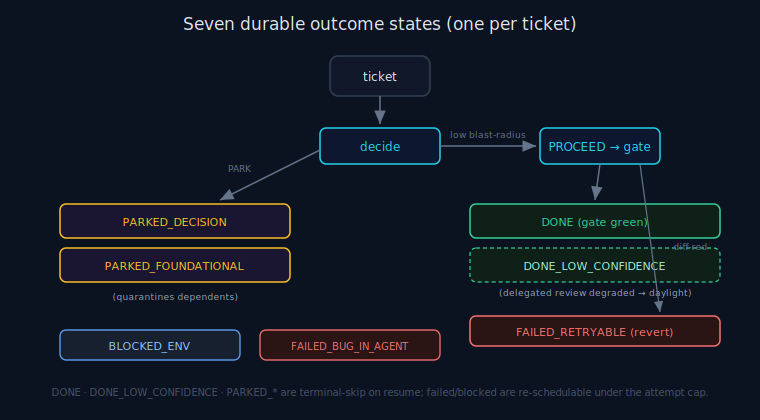

# ANS State Machine

> **30-second version.** Every ticket ANS processes ends in **exactly one** of seven durable outcome
> states, written atomically so a crash or resume never loses or double-counts work. The states are not
> collapsed: "done", "done but flag for review", "parked a decision", "parked a foundation", "blocked by
> the environment", "failed but retryable", and "failed — agent bug" are all distinct, because the morning
> response to each is different. This is the durable backbone that makes an unattended run *resumable*.
> See [recovery](recovery.md), [scheduling](scheduling.md), and the [glossary](glossary.md).



*Diagram: The seven durable outcome states and the transitions into them.*

## Why a durable per-ticket state machine

An overnight run is a sequence of small, independent units of work. If the run crashes at ticket 23, the
morning must know exactly which of the first 22 are trustworthy, which need a human look, and which to
retry — without re-running anything. That requires a *durable* record per ticket, written the instant the
outcome is known, and a *precise* vocabulary so "done" never silently means "done but the review errored".
ANS's state machine (`state.py`) is that record and that vocabulary.

## The seven outcome states

Recorded as `OutcomeState` in `state.py`. Each ticket gets exactly one:

| State | Meaning | Morning response |
|---|---|---|
| **DONE** | Completed; the deterministic gate is green. | Trust it. |
| **DONE_LOW_CONFIDENCE** | Gate green, but the *delegated* review coverage was degraded (a high-risk diff whose council raised concerns, errored, or never ran). | **NEEDS DAYLIGHT REVIEW** — done, not trusted to merge blind. |
| **PARKED_DECISION** | One decision deferred; the run kept moving. | Make the 5-second decision; the candidate interpretations + exact next-action are recorded. |
| **PARKED_FOUNDATIONAL** | A foundational ambiguity; the ticket parked **and** its dependents were quarantined. | Resolve the foundation; un-quarantine the dependents. |
| **BLOCKED_ENV** | The environment/tooling blocked progress (e.g. git lock, un-runnable gate) — not the agent's fault. | Fix the environment, re-run. |
| **FAILED_RETRYABLE** | A gate failed on the diff; the edit was reverted; retry is safe. | Retry (or inspect if it keeps failing). |
| **FAILED_BUG_IN_AGENT** | The harness/agent did something wrong. | Needs a human look. |

The first four are *terminal-skip-on-resume* (`TERMINAL_SKIP_ON_RESUME`): a fresh `next` after a resume
does not re-offer a ticket already in one of these states. The failed/blocked states are re-schedulable
under the attempt cap.

## The per-ticket lifecycle

```
   next ──► decide PROCEED/PARK/HALT (blast radius)
              │
              ├─ PARK  ──────────────► record PARKED_DECISION / PARKED_FOUNDATIONAL
              │
              └─ PROCEED ─► snapshot ─► AGENT implements ─► complete ─► GATE
                                                                         │
                                              green ─► (optional delegated review) ─► DONE / DONE_LOW_CONFIDENCE
                                              red, diff-introduced ─► revert ─► FAILED_RETRYABLE (or PARK at cap)
                                              red, pre-existing/flaky ─► confidence down, continue
                                              cannot snapshot / gate un-runnable ─► BLOCKED_ENV
```

A PARK is recorded *before* any edit (the decision is the work). A PROCEED is recorded only *after* the
gate runs on the real diff — so a DONE always means "gate-green", never "the agent thinks it's done".

## What each outcome record carries

Every `TicketOutcome` (`state.py`) records the fields needed to act in the morning without re-deriving
context: the `state`, a human-readable `why`, the `exact_blocker` (if any), `human_action_required`,
`review_coverage` (which delegated lenses ran, if any), `contamination_scope` and any
`dependents_quarantined` (for a foundational park), `work_product_behind_flag` (for the hybrid
build-narrow-and-park case), and timestamps. A park is only useful if the morning decision is fast —
hence the recorded candidate interpretations and the exact next-action.

## Atomic, resume-safe, secret-scrubbed writes

Three durability properties make the state machine trustworthy:

1. **Atomic.** Outcomes are written via a temp-file-then-rename (`_atomic_write_json`), so a crash mid-write
   never leaves a half-written record. On resume the store reads back clean JSON.
2. **Resume-safe.** Each `next`/`complete` is a fresh process; nothing about progress is held in memory.
   Breaker accounting is recomputed from the durable store every call. A crash between `next` and `complete`
   is recovered on the next `next` (the partial edits are reverted to the pending snapshot and the ticket
   is re-scheduled under its attempt cap). See [recovery](recovery.md).
3. **Secret-scrubbed.** The persisted outcome is passed through the redaction layer (`redact_obj`) before
   it is written, so a credential-shaped value can never leak into a state file. See [secrets](secrets.md).

## Boundary

The state machine records *execution* outcomes. `DONE_LOW_CONFIDENCE` is the one place a verification
signal touches state — and even there ANS does not verify anything itself: the signal comes from a
*delegated* advisory review (the external Tokonomix Council MCP), and ANS only translates it into a
trust-or-flag disposition. See [governance](governance.md) and the [glossary](glossary.md) ecosystem table.

## Limitations

The states describe *what happened to the ticket*, not whether the code is correct. A DONE means the
deterministic gate passed, not that the change is right; a DONE_LOW_CONFIDENCE is a flag for human
attention, not a verdict. The vocabulary is honest precisely so these are never confused.

---

*Verified against `agents_never_sleep/` (v1.0.0): `state.py` (`OutcomeState`, `TicketOutcome`,
`OutcomeStore`, `TERMINAL_SKIP_ON_RESUME`, `_atomic_write_json`, `redact_obj`), `driver.py`, README §6,
`ARCHITECTURE.md` §4.*
