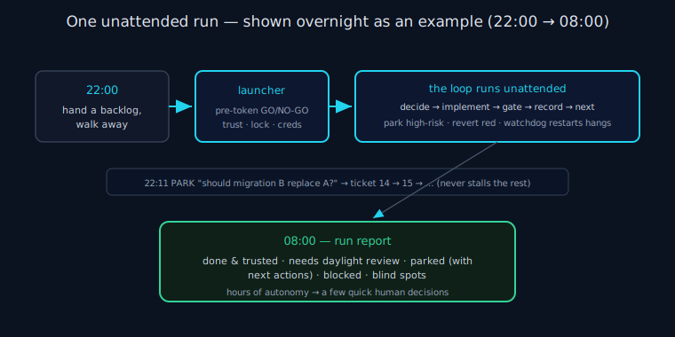

# Tutorial — run your first unattended backlog

> **30-second version.** This walks you end-to-end through your first ANS run: install → write a tiny
> backlog → drive the `next → implement → complete` loop → watch the autonomy contract (PROCEED / PARK /
> HALT) act on real tickets → read the run report. By the end you'll understand *why* ANS exists (so a
> coding agent never stalls the whole backlog on one unanswerable question) and *when* to reach for it (any
> run-to-completion handoff you walk away from). For the *how it works* depth, this tutorial links the
> [architecture](architecture.md), [state machine](state-machine.md), and [deterministic gates](deterministic-gates.md)
> rather than re-explaining them.

Every command below matches the real CLI (`agents_never_sleep.run`, v1.0.0). There is **no `run`
subcommand** — you drive the loop with `next` and `complete`.



*Diagram: One unattended run end to end, shown overnight (22:00 → 08:00) as an example, from handing off a backlog to reading the morning report.*

## 0. What you need

- A git repository (ANS uses git for snapshot/revert — reversibility is non-negotiable).
- A coding agent CLI you'll use as the *worker* — e.g. Claude Code. ANS is the governor; the agent does
  the edits.
- Python 3 (the harness is stdlib-only).

## 1. Install

```bash
pip install git+https://github.com/TokonoMix/agents-never-sleep@v1.0.0
# or, from a checkout, to hack on it:
#   pip install -e .
```

> PyPI is **not** live yet, so `pip install agents-never-sleep` (bare) does not work today — use the
> GitHub install above. See the [roadmap](roadmap.md).

## 2. Understand the contract (one minute, it's the whole point)

Unattended, the agent has exactly three responses to uncertainty, and **never** a fourth:

- **PROCEED** — assume a reasonable answer, log it, continue. Reversibly (every change is git-snapshotted).
  Chosen only for low-blast-radius, reversible decisions.
- **PARK** — defer *this one* ticket/decision and keep the run moving to the next independent ticket.
  Parking is normal and healthy — the opposite of stopping.
- **HALT** — stop the whole run. Only on genuinely irreversible danger.
- **ASK** — *forbidden while unattended.* There's nobody to answer at 2am, so every would-be ASK becomes a
  PARK. (See [governance](governance.md) and [decision model](decision-model.md).)

## 3. Write a tiny backlog

Tickets are plain Markdown files in a directory. The **body is the only required content** — the harness
auto-classifies blast radius. Make a backlog with two tickets: one safe to implement, one deliberately
high-blast-radius so you can watch PARK happen.

```bash
mkdir -p backlog
```

`backlog/README.md` (optional, describes the run):

```markdown
# My first ANS backlog
Two tickets: a safe rename, and a schema change (which ANS must PARK, not guess).
```

`backlog/01-rename-helper.md` — a low-blast-radius PROCEED:

```markdown
---
id: 01-rename-helper
title: Rename the internal `tmp2` variable to `retry_count`
---
In src/worker.py, rename the local variable `tmp2` to `retry_count` for readability.
Internal-only; no behaviour change.
```

`backlog/02-change-user-schema.md` — a Hard-PARK (it touches a database migration):

```markdown
---
id: 02-change-user-schema
title: Decide the users-table migration direction
---
Should the new `users.locale` column default to 'en' or be NOT NULL with a backfill migration?
Add the column and write the migration accordingly.
```

ANS will PROCEED ticket 01 and **PARK** ticket 02 — choosing a database migration direction is a Hard-PARK
category (see [blast radius](blast-radius.md)); it records the candidate interpretations and the exact
human next-action instead of guessing.

## 4. First (interactive) run — create the per-project config

The first interactive run triggers a one-time wizard that writes `.claude/agents-never-sleep.json` (your
gate command, budget, etc.). Run `next` once from the repo root:

```bash
cd /path/to/your/repo
python3 -m agents_never_sleep.run next --repo . --tickets ./backlog
```

> Always run from the repo root and pass `--repo .` so the run-incomplete sentinel and the Stop-hook agree
> on the same path (see the [execution model](execution-model.md)). And pass `--tickets ./backlog` on
> **both** `next` and `complete` — omitting it on `complete` defaults to `./tickets` and would mis-target
> the run.

## 5. Drive the loop: `next → implement → complete`

Each subcommand prints one JSON object. The loop is: ask for a ticket, implement it, record the outcome,
repeat.

```bash
# Ask for the next ticket
python3 -m agents_never_sleep.run next --repo . --tickets ./backlog
# → {"status":"PROCEED","ticket":{"id":"01-rename-helper","body":"…","path":"…"},"snapshot":"<sha>", …}
```

On `status: "PROCEED"`, **you (the worker agent) implement only `ticket.body`** by editing files — here,
rename `tmp2` → `retry_count` in `src/worker.py`. Do not touch other tickets, do not stop, do not ask.
Then record the outcome:

```bash
python3 -m agents_never_sleep.run complete --repo . --tickets ./backlog \
  --attempted "Renamed tmp2 to retry_count in src/worker.py"
# → {"status":"RECORDED","ticket_id":"01-rename-helper","state":"DONE","next":"call `next`"}
```

Behind that `complete`, ANS ran your project's **deterministic gate** (your tests / type-check) on the
diff. Green → `DONE`. A regression the diff introduced → it reverts to the pre-edit snapshot and records
`FAILED_RETRYABLE`. A pre-existing/flaky failure → confidence downgraded, run continues. (See
[deterministic gates](deterministic-gates.md).) If you genuinely cannot do the ticket, use
`--cannot-implement --attempted "why"` and ANS reverts your partial edits and records `BLOCKED_ENV`.

Now call `next` again:

```bash
python3 -m agents_never_sleep.run next --repo . --tickets ./backlog
# → ticket 02 is NOT handed to you — it was auto-PARKED (Hard-PARK: db migration).
# → you receive the NEXT independent ticket, or a terminal status:
# → {"status":"DRAINED", …}
```

Ticket 02 never reaches you as a PROCEED: `next` classified it as a database-migration decision (a
Hard-PARK category) and recorded `PARKED_DECISION` itself, with the candidate interpretations ('en' default
vs NOT NULL + backfill) and the exact decision a human needs to make. That is PARK in action — the run kept moving
instead of guessing a schema direction.

Keep alternating `next`/`complete` until `next` returns a **terminal** status: `DRAINED`, `HALTED`, or
`LOW_YIELD`. Never invent your own loop or stop early — `next` owns the never-stop sentinel.

## 6. What you just watched (the machinery)

- The **state machine** recorded one durable outcome per ticket: `DONE` for 01, `PARKED_DECISION` for 02
  ([state machine](state-machine.md)).
- **Reversibility:** ticket 01 was snapshotted before the edit; had the gate gone red, the rename would
  have been reverted automatically ([recovery](recovery.md)).
- **Anti-starvation:** if a ticket kept failing, the attempt cap / loop detector would force-park it rather
  than burn the run ([scheduling](scheduling.md)). (If a *healthy* ticket gets force-parked because a
  kill+resume inflated its counter, recover it with `python3 -m agents_never_sleep.run reset-attempts
  <ticket-id> --repo . --tickets ./backlog`.)

## 7. Go unattended — `bin/ans-run`

For a real unattended / detached run, launch through the launcher instead of driving by hand. It runs a
pre-token GO/NO-GO gate (config trust, identity, agent selection, credentials, repo health, working-tree
lock) *before* the agent CLI boots:

```bash
bin/ans-run --repo . --agent claude "Work the backlog in ./backlog to completion: \
  python3 -m agents_never_sleep.run next --repo . --tickets ./backlog ; implement ; \
  python3 -m agents_never_sleep.run complete --repo . --tickets ./backlog --attempted '…' ; repeat."
```

First time, the launcher asks you to **trust** the config once (TOFU). Install the Claude Code enforcement
hooks (`hooks/README.md`) so never-ASK / never-irreversible are enforced *structurally*, and optionally
wrap the run in the [watchdog](watchdog.md) so a hang is restarted. See the [launcher](launcher.md) doc for
exit codes (0 GO / 64 NO-GO / 65 tree busy) and the autonomy-flag confirmation.

## 8. Read the run report

```bash
python3 -m agents_never_sleep.run report --repo . --tickets ./backlog
```

The report (`night-report.md`) ranks: **done & trusted**, **needs daylight review** (a high-risk diff whose
*delegated* review flagged it), **parked** (with the exact next action — e.g. "decide the users.locale
migration direction"), **blocked**, and **blind spots**. This is the payoff: a run of autonomous work
turned into a few quick human decisions.

## Where verification fits (it isn't ANS)

You may have noticed ANS never told you whether your rename was *correct* beyond the gate passing. That's
deliberate: ANS owns **execution only**. For a high-risk diff it can *optionally delegate* a second opinion
to the external **Tokonomix Council MCP** (a separate building block) and use the verdict only to flag
`DONE_LOW_CONFIDENCE` / NEEDS DAYLIGHT REVIEW — it does not verify code itself. Verification lives in the
Council; ANS governs the run. See the [glossary](glossary.md) ecosystem table.

## Next steps

- The full command/flag reference: the repo `ARCHITECTURE.md`.
- How decisions are made: [governance](governance.md), [decision model](decision-model.md), [blast radius](blast-radius.md).
- How it survives failure: [recovery](recovery.md), [watchdog](watchdog.md).
- Measuring autonomy: [benchmarks](benchmarks.md) (methodology, not claimed results).

---

*Verified against `agents_never_sleep/` (v1.0.0): `run.py` (subcommands `next` / `complete` / `report` /
`reset-attempts` / `reset-spend` / `parked`; flags `--repo`, `--tickets`, `--attempted`,
`--cannot-implement`, etc. — no `run` subcommand), `bin/ans-run`, the ticket format in `ARCHITECTURE.md`
§2, README §9–§10.*
